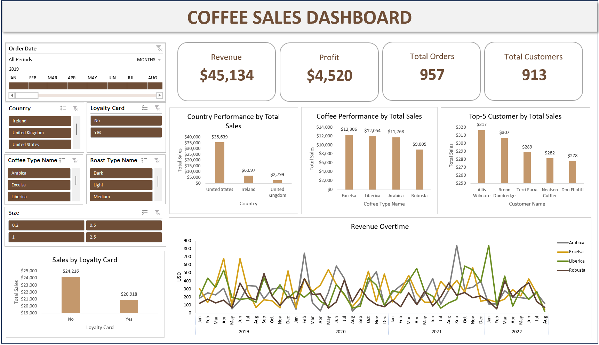

# ☕ Coffee Sales Dashboard

Interactive sales analytics dashboard built in Excel to monitor 
revenue performance, customer behavior, and loyalty program effectiveness.

## 🎯 Problem
Coffee shop sales data was scattered with no centralized visualization,
making it difficult to monitor performance or answer key business 
questions — which markets/products perform best, and whether the 
loyalty program is actually working.

## 🛠️ Tools & Techniques
- **Excel**
  - PivotTable & PivotChart for dynamic data summarization
  - VLOOKUP / XLOOKUP for cross-referencing product & customer data
  - Slicers for interactive multi-dimensional filtering
  - Formula-based KPI cards (Revenue, Profit,Total Order, Total Order)

## 📊 Key Insights
1. **Market concentration risk** — United States contributes 79% 
   of total revenue ($35,639), indicating heavy reliance on a 
   single market.
2. **Low repeat purchase rate** — 957 orders from 913 customers 
   (~1.05 orders/customer) suggests weak customer retention.
3. **Loyalty program underperforming** — Card members spend less 
   per transaction ($20,918) than non-members ($24,216), 
   challenging the assumption that loyalty programs drive higher spend.

## 📁 Files
- `coffee_sales_dashboard.xlsx` — Data & full interactive dashboard

## 🔗 How to Use
1. Download `coffee_sales_dashboard.xlsx`
2. Open in Excel (slicers require Excel 2013+)
3. Use slicers on the left to filter by Country, Coffee Type, 
   Loyalty Card, etc.
